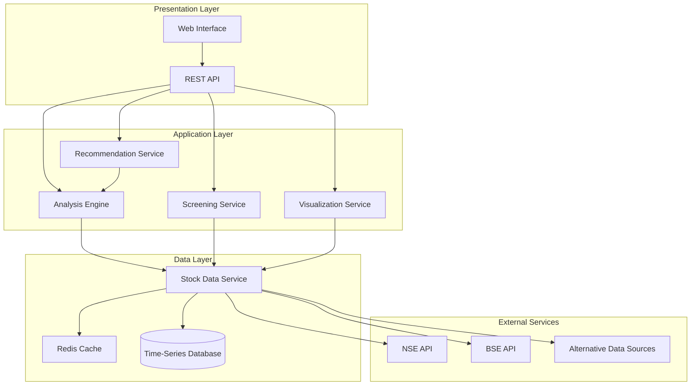

# Design Document: Stock Market Analysis AI

## Overview

The Stock Market Analysis AI system is a real-time stock analysis platform focused on Indian markets (NSE/BSE). The system architecture follows a modular design with clear separation between data acquisition, analysis, storage, and presentation layers.

### Key Design Principles

1. **Real-time Processing**: Minimize latency between data acquisition and analysis
2. **Scalability**: Support concurrent users and bulk analysis operations
3. **Reliability**: Graceful degradation when external services fail
4. **Modularity**: Independent components that can be developed and tested separately
5. **Data Integrity**: Ensure accuracy and consistency of financial data

### Technology Stack Considerations

For Indian stock market data, the system will integrate with:
- NSE/BSE official APIs or authorized data providers
- Alternative sources: Yahoo Finance API, Alpha Vantage (with Indian market support)
- WebSocket connections for real-time data streaming where available

## Architecture

The system follows a layered architecture with the following components:



### Architecture Layers

**Presentation Layer**: Handles user interactions and API requests
- Web interface for visualization and user input
- REST API for programmatic access
- WebSocket support for real-time updates

**Application Layer**: Core business logic
- Analysis Engine: AI-based stock evaluation
- Recommendation Service: Generates investment recommendations
- Screening Service: Filters stocks based on criteria
- Visualization Service: Prepares chart data

**Data Layer**: Data management and persistence
- Stock Data Service: Fetches and normalizes market data
- Cache: Redis for frequently accessed data (60-second TTL)
- Time-Series Database: Historical data storage (InfluxDB or TimescaleDB)

**External Services**: Third-party data providers
- NSE/BSE APIs for official market data
- Alternative sources for redundancy

## Components and Interfaces

### 1. Stock Data Service

**Responsibility**: Fetch, normalize, and cache stock market data from multiple sources

**Interface**:
```
class StockDataService:
    function fetchLiveData(symbol: String, exchange: Exchange) -> StockData
    function fetchHistoricalData(symbol: String, startDate: Date, endDate: Date) -> List<StockData>
    function subscribeToUpdates(symbol: String, callback: Function) -> Subscription
    function validateSymbol(symbol: String, exchange: Exchange) -> Boolean
```

**Key Operations**:
- **fetchLiveData**: Retrieves current stock data with caching
  - Check cache first (60-second TTL during market hours)
  - If cache miss, fetch from primary source (NSE/BSE)
  - On failure, try alternative sources
  - Validate data completeness before returning
  
- **fetchHistoricalData**: Retrieves historical data from database
  - Query time-series database with date range
  - Return data sorted by timestamp
  - Handle missing data points gracefully

- **subscribeToUpdates**: WebSocket subscription for real-time updates
  - Establish WebSocket connection to data source
  - Register callback for price updates
  - Handle reconnection on connection loss

**Data Normalization**:
- Convert all timestamps to UTC internally, display in IST
- Standardize symbol formats (NSE: SYMBOL.NS, BSE: SYMBOL.BO)
- Normalize currency to INR (₹)
- Handle corporate actions (splits, dividends)

### 2. Analysis Engine

**Responsibility**: Perform AI-based analysis of stocks using multiple factors

**Interface**:
```
class AnalysisEngine:
    function analyzeStock(symbol: String) -> AnalysisResult
    function analyzeBatch(symbols: List<String>) -> List<AnalysisResult>
    function calculateConfidence(analysis: AnalysisResult) -> Float
```

**Analysis Factors**:

1. **Technical Indicators**:
   - Moving Averages (50-day, 200-day SMA)
   - Relative Strength Index (RSI)
   - Moving Average Convergence Divergence (MACD)
   - Bollinger Bands
   - Volume trends

2. **Fundamental Metrics**:
   - Price-to-Earnings (P/E) ratio
   - Price-to-Book (P/B) ratio
   - Debt-to-Equity ratio
   - Return on Equity (ROE)
   - Earnings growth rate

3. **Market Context**:
   - Sector performance comparison
   - Market cap category (Large/Mid/Small cap)
   - Beta (volatility relative to market)
   - Correlation with sector index

**Analysis Algorithm**:
```
function analyzeStock(symbol):
    stockData = dataService.fetchLiveData(symbol)
    historicalData = dataService.fetchHistoricalData(symbol, last_365_days)
    
    technicalScore = calculateTechnicalScore(stockData, historicalData)
    fundamentalScore = calculateFundamentalScore(stockData)
    marketScore = calculateMarketScore(stockData)
    
    weightedScore = (technicalScore * 0.4) + (fundamentalScore * 0.4) + (marketScore * 0.2)
    confidence = calculateConfidence(stockData, historicalData)
    
    return AnalysisResult(
        symbol: symbol,
        score: weightedScore,
        confidence: confidence,
        factors: {technical: technicalScore, fundamental: fundamentalScore, market: marketScore},
        timestamp: currentTime()
    )
```

**Confidence Calculation**:
- Base confidence: 50%
- Add 10% if data is complete (all required fields present)
- Add 10% if historical data >= 1 year
- Add 10% if volume is above average (indicates liquidity)
- Add 10% if multiple indicators agree (convergence)
- Add 10% if sector data is available
- Maximum confidence: 100%

### 3. Recommendation Service

**Responsibility**: Generate investment recommendations based on analysis results

**Interface**:
```
class RecommendationService:
    function generateRecommendation(symbol: String) -> Recommendation
    function generateBulkRecommendations(symbols: List<String>, limit: Integer) -> List<Recommendation>
    function explainRecommendation(recommendation: Recommendation) -> Explanation
```

**Recommendation Logic**:
```
function generateRecommendation(symbol):
    analysis = analysisEngine.analyzeStock(symbol)
    
    if analysis.confidence < 50:
        return Recommendation(
            symbol: symbol,
            action: "INSUFFICIENT_DATA",
            confidence: analysis.confidence,
            rationale: "Insufficient data for reliable recommendation"
        )
    
    score = analysis.score
    action = determineAction(score)
    rationale = buildRationale(analysis)
    
    return Recommendation(
        symbol: symbol,
        action: action,
        confidence: analysis.confidence,
        rationale: rationale,
        keyFactors: extractTopFactors(analysis, 3),
        timestamp: currentTime()
    )

function determineAction(score):
    if score >= 80: return "STRONG_BUY"
    if score >= 65: return "BUY"
    if score >= 45: return "HOLD"
    if score >= 30: return "SELL"
    return "STRONG_SELL"
```

**Rationale Generation**:
- Identify top 3 contributing factors (highest weighted scores)
- Generate human-readable explanations for each factor
- Include specific metric values (e.g., "RSI at 35 indicates oversold")
- Mention sector context if relevant

### 4. Screening Service

**Responsibility**: Filter stocks based on user-defined criteria

**Interface**:
```
class ScreeningService:
    function screenStocks(criteria: ScreeningCriteria) -> List<StockSummary>
    function savePreset(name: String, criteria: ScreeningCriteria) -> PresetId
    function loadPreset(presetId: PresetId) -> ScreeningCriteria
    function getAvailableFilters() -> List<FilterDefinition>
```

**Screening Criteria Structure**:
```
class ScreeningCriteria:
    marketCapRange: Range<Float>
    peRatioRange: Range<Float>
    sectors: List<String>
    priceRange: Range<Float>
    volumeRange: Range<Integer>
    customFilters: Map<String, FilterValue>
```

**Screening Algorithm**:
```
function screenStocks(criteria):
    allStocks = dataService.getAllTrackedStocks()
    results = []
    
    for stock in allStocks:
        if matchesCriteria(stock, criteria):
            summary = createStockSummary(stock)
            results.append(summary)
    
    return sortResults(results, criteria.sortBy)

function matchesCriteria(stock, criteria):
    if not inRange(stock.marketCap, criteria.marketCapRange):
        return false
    if not inRange(stock.peRatio, criteria.peRatioRange):
        return false
    if criteria.sectors and stock.sector not in criteria.sectors:
        return false
    if not inRange(stock.currentPrice, criteria.priceRange):
        return false
    if not inRange(stock.volume, criteria.volumeRange):
        return false
    
    return true
```

**Performance Optimization**:
- Use database indexes on commonly filtered fields (marketCap, sector, price)
- Implement query result caching for popular screening criteria
- Limit results to 1000 stocks maximum
- Use pagination for large result sets

### 5. Visualization Service

**Responsibility**: Prepare data for charts and graphs

**Interface**:
```
class VisualizationService:
    function getPriceChart(symbol: String, period: TimePeriod) -> ChartData
    function getComparisonChart(symbols: List<String>, period: TimePeriod) -> ChartData
    function getVolumeChart(symbol: String, period: TimePeriod) -> ChartData
    function getCandlestickData(symbol: String, period: TimePeriod) -> CandlestickData
```

**Chart Data Preparation**:
```
function getPriceChart(symbol, period):
    historicalData = dataService.fetchHistoricalData(symbol, period.startDate, period.endDate)
    
    pricePoints = extractPricePoints(historicalData)
    movingAverage50 = calculateSMA(pricePoints, 50)
    movingAverage200 = calculateSMA(pricePoints, 200)
    
    return ChartData(
        labels: extractDates(historicalData),
        datasets: [
            {name: "Price", data: pricePoints, type: "line"},
            {name: "50-day MA", data: movingAverage50, type: "line"},
            {name: "200-day MA", data: movingAverage200, type: "line"}
        ]
    )
```

**Supported Chart Types**:
- Line charts: Price trends over time
- Candlestick charts: OHLC (Open, High, Low, Close) data
- Bar charts: Volume data
- Comparison charts: Multiple stocks normalized to percentage change

### 6. Cache Manager

**Responsibility**: Manage Redis cache for frequently accessed data

**Caching Strategy**:
- **Live stock data**: 60-second TTL during market hours, 5-minute TTL after hours
- **Analysis results**: 5-minute TTL (analysis is computationally expensive)
- **Screening results**: 2-minute TTL for popular criteria
- **Historical data**: 1-hour TTL (rarely changes)

**Cache Key Format**:
- `stock:live:{symbol}:{exchange}` - Live stock data
- `analysis:{symbol}:{timestamp}` - Analysis results
- `screening:{criteriaHash}` - Screening results
- `historical:{symbol}:{startDate}:{endDate}` - Historical data

## Data Models

### StockData
```
class StockData:
    symbol: String
    exchange: Exchange (NSE | BSE)
    currentPrice: Float
    openPrice: Float
    highPrice: Float
    lowPrice: Float
    previousClose: Float
    volume: Integer
    marketCap: Float
    peRatio: Float
    pbRatio: Float
    week52High: Float
    week52Low: Float
    beta: Float
    timestamp: DateTime
```

### AnalysisResult
```
class AnalysisResult:
    symbol: String
    overallScore: Float (0-100)
    confidence: Float (0-100)
    technicalScore: Float
    fundamentalScore: Float
    marketScore: Float
    indicators: Map<String, Float>
    timestamp: DateTime
```

### Recommendation
```
class Recommendation:
    symbol: String
    action: RecommendationAction (STRONG_BUY | BUY | HOLD | SELL | STRONG_SELL)
    confidence: Float (0-100)
    rationale: String
    keyFactors: List<Factor>
    timestamp: DateTime
    expiresAt: DateTime
```

### Factor
```
class Factor:
    name: String
    value: String
    impact: Impact (POSITIVE | NEGATIVE | NEUTRAL)
    weight: Float
```

### GrowthMetrics
```
class GrowthMetrics:
    symbol: String
    day1Change: Float (percentage)
    week1Change: Float
    month1Change: Float
    month3Change: Float
    month6Change: Float
    year1Change: Float
    volatility: Float
    averageVolume: Integer
```

### ScreeningCriteria
```
class ScreeningCriteria:
    marketCapMin: Float
    marketCapMax: Float
    peRatioMin: Float
    peRatioMax: Float
    sectors: List<String>
    priceMin: Float
    priceMax: Float
    volumeMin: Integer
    volumeMax: Integer
    sortBy: String
    sortOrder: SortOrder (ASC | DESC)
```

## Data Storage

### Time-Series Database Schema

**Table: stock_prices**
```
time: timestamp (primary key)
symbol: string (indexed)
exchange: string
open: float
high: float
low: float
close: float
volume: integer
```

**Table: stock_metrics**
```
time: timestamp (primary key)
symbol: string (indexed)
market_cap: float
pe_ratio: float
pb_ratio: float
beta: float
week_52_high: float
week_52_low: float
```

**Table: analysis_history**
```
time: timestamp (primary key)
symbol: string (indexed)
overall_score: float
confidence: float
technical_score: float
fundamental_score: float
market_score: float
```

### Relational Database Schema

**Table: stocks**
```
id: integer (primary key)
symbol: string (unique)
exchange: string
name: string
sector: string
industry: string
created_at: timestamp
updated_at: timestamp
```

**Table: screening_presets**
```
id: integer (primary key)
user_id: integer
name: string
criteria: json
created_at: timestamp
```

**Table: user_watchlists**
```
id: integer (primary key)
user_id: integer
symbol: string
added_at: timestamp
```

## Data Flow Examples

### Example 1: User Requests Stock Recommendation

```
1. User requests recommendation for "RELIANCE.NS"
2. API receives request, validates symbol
3. RecommendationService.generateRecommendation("RELIANCE.NS")
4. Service calls AnalysisEngine.analyzeStock("RELIANCE.NS")
5. AnalysisEngine calls DataService.fetchLiveData("RELIANCE.NS")
6. DataService checks cache:
   - Cache hit: return cached data
   - Cache miss: fetch from NSE API, cache result, return data
7. AnalysisEngine calls DataService.fetchHistoricalData("RELIANCE.NS", last_365_days)
8. DataService queries time-series database
9. AnalysisEngine calculates technical, fundamental, and market scores
10. AnalysisEngine returns AnalysisResult
11. RecommendationService determines action based on score
12. RecommendationService builds rationale and key factors
13. RecommendationService returns Recommendation
14. API returns JSON response to user
```

### Example 2: Real-time Data Update

```
1. System establishes WebSocket connection to NSE data feed
2. Price update received for "TCS.NS"
3. DataService validates and normalizes data
4. DataService updates cache with new data
5. DataService stores data point in time-series database
6. DataService triggers callback for active subscriptions
7. Connected clients receive real-time update via WebSocket
```

### Example 3: Stock Screening

```
1. User applies screening criteria: Market Cap > 10000 CR, P/E < 25, Sector = IT
2. API receives screening request
3. ScreeningService.screenStocks(criteria)
4. Service checks cache for this criteria hash
5. Cache miss: execute screening logic
6. Service queries database with filters
7. Database returns matching stocks (indexed query)
8. Service enriches results with current prices from cache
9. Service sorts results by specified field
10. Service caches results for 2 minutes
11. API returns paginated results to user
```


## Correctness Properties

*A property is a characteristic or behavior that should hold true across all valid executions of a system—essentially, a formal statement about what the system should do. Properties serve as the bridge between human-readable specifications and machine-verifiable correctness guarantees.*

### Property 1: Stock Data Retrieval Completeness
*For any* valid stock symbol and exchange, when live data is requested, the returned StockData object should contain all required fields (currentPrice, volume, marketCap, timestamp) and be retrieved within 5 seconds.

**Validates: Requirements 1.2, 1.5**

### Property 2: Data Update Frequency During Market Hours
*For any* stock being tracked during market hours, the time interval between consecutive data updates should not exceed 60 seconds.

**Validates: Requirements 1.3**

### Property 3: Connection Failure Recovery
*For any* data source connection failure, the system should log the error and attempt reconnection within 30 seconds.

**Validates: Requirements 1.4**

### Property 4: Analysis Factor Completeness
*For any* stock analyzed, the AnalysisResult should include evaluations of all required factors: price trends, volume patterns, market cap, P/E ratio, and sector performance.

**Validates: Requirements 2.1**

### Property 5: Analysis Performance
*For any* single stock analysis request, the Analysis_Engine should complete evaluation within 10 seconds.

**Validates: Requirements 2.2**

### Property 6: Concurrent Analysis Efficiency
*For any* batch of N stocks analyzed concurrently, the total processing time should be less than N times the average single-stock analysis time.

**Validates: Requirements 2.3**

### Property 7: Confidence Score Bounds
*For any* analysis result, the confidence score should be a value between 0 and 100 (inclusive).

**Validates: Requirements 2.4**

### Property 8: Insufficient Data Confidence
*For any* stock with insufficient historical data (less than 1 year), the analysis confidence score should be below 70 and the result should specify missing data requirements.

**Validates: Requirements 2.5**

### Property 9: Recommendation Action Validity
*For any* generated recommendation, the action field should be exactly one of: "STRONG_BUY", "BUY", "HOLD", "SELL", or "STRONG_SELL".

**Validates: Requirements 3.1**

### Property 10: Recommendation Rationale Completeness
*For any* recommendation with confidence >= 50, the rationale should include at least 3 key factors explaining the recommendation.

**Validates: Requirements 3.2**

### Property 11: Recommendation Metadata Completeness
*For any* recommendation, it should include both a confidence score and a timestamp.

**Validates: Requirements 3.3**

### Property 12: Recommendation Ranking Order
*For any* list of multiple recommendations, they should be sorted by confidence score in descending order.

**Validates: Requirements 3.4**

### Property 13: Outdated Recommendation Flagging
*For any* recommendation older than 24 hours, it should be flagged as outdated when displayed.

**Validates: Requirements 3.5**

### Property 14: Growth Metrics Completeness
*For any* stock with sufficient historical data, the displayed growth metrics should include percentage changes for all six time periods: 1 day, 1 week, 1 month, 3 months, 6 months, and 1 year.

**Validates: Requirements 4.1**

### Property 15: Missing Growth Metric Handling
*For any* stock where a growth metric cannot be calculated due to insufficient data, the system should display "N/A" with an explanation for that specific metric.

**Validates: Requirements 4.2**

### Property 16: Performance Indicator Completeness
*For any* stock display, it should include all required performance indicators: P/E ratio, market cap, 52-week high, 52-week low, average daily volume, beta, and standard deviation.

**Validates: Requirements 4.3, 4.5**

### Property 17: Stock Comparison Normalization
*For any* set of stocks being compared, the metrics should be normalized to percentage-based values to enable fair comparison across different price ranges.

**Validates: Requirements 4.4**

### Property 18: Screening Filter Support
*For any* screening request, the system should support filtering by all specified criteria types: market cap range, P/E ratio range, sector, price range, and volume range.

**Validates: Requirements 5.1**

### Property 19: Screening Performance
*For any* screening criteria applied to up to 1000 stocks, results should be returned within 15 seconds.

**Validates: Requirements 5.2**

### Property 20: Multi-Filter AND Logic
*For any* screening with multiple filters applied, all returned stocks should satisfy every filter criterion (AND logic).

**Validates: Requirements 5.3**

### Property 21: Screening Preset Round-Trip
*For any* screening criteria saved as a preset, loading that preset should produce criteria equivalent to the original, and applying it should yield the same results.

**Validates: Requirements 5.4**

### Property 22: Screening Result Metadata
*For any* screening result, it should include the count of matching stocks and support sorting by any displayed metric.

**Validates: Requirements 5.5**

### Property 23: Chart Time Period Support
*For any* stock, the system should be able to generate price chart data for all specified time periods: 1 day, 1 week, 1 month, 3 months, 6 months, 1 year, and 5 years.

**Validates: Requirements 6.1**

### Property 24: Chart Data Completeness
*For any* price chart generated, the chart data should include price points, volume bars, 50-day moving average, and 200-day moving average (when sufficient data exists).

**Validates: Requirements 6.2**

### Property 25: Multi-Stock Comparison Charts
*For any* set of 2 or more stocks, the system should generate comparison chart data with normalized values for all stocks.

**Validates: Requirements 6.3**

### Property 26: Chart Generation Performance
*For any* chart visualization request, the chart data should be prepared and ready for rendering within 3 seconds.

**Validates: Requirements 6.4**

### Property 27: Chart Type Support
*For any* stock, the system should support generating data for all chart types: line charts, candlestick charts, and bar charts for volume.

**Validates: Requirements 6.5**

### Property 28: Historical Data Storage Completeness
*For any* stock data stored, the database record should include all required fields: closing price, volume, and calculated metrics (P/E, market cap, etc.).

**Validates: Requirements 7.1**

### Property 29: Historical Data Duplicate Prevention
*For any* stock and date combination, attempting to store data twice should result in only one record in the database.

**Validates: Requirements 7.2**

### Property 30: Historical Data Query Performance
*For any* single stock historical data query, results should be returned within 5 seconds.

**Validates: Requirements 7.4**

### Property 31: Rate Limit Handling with Exponential Backoff
*For any* API rate limit error, the system should queue the request and retry with exponentially increasing delays (e.g., 1s, 2s, 4s, 8s).

**Validates: Requirements 8.1**

### Property 32: Cached Data Fallback
*For any* request when real-time data is unavailable, the system should return the most recent cached data and include a staleness indicator showing the cache age.

**Validates: Requirements 8.2**

### Property 33: Analysis Error Handling
*For any* analysis failure, the system should log error details (timestamp, symbol, error message) and return a user-friendly error message without exposing internal details.

**Validates: Requirements 8.3**

### Property 34: Invalid Symbol Rejection
*For any* invalid stock symbol input, the system should reject it with a descriptive error message indicating the symbol format requirements.

**Validates: Requirements 8.4**

### Property 35: System Stability Under Errors
*For any* critical error condition (database failure, API timeout, invalid data), the system should handle the error gracefully and continue processing other requests without crashing.

**Validates: Requirements 8.5**

### Property 36: Bulk Request Rate Limiting
*For any* bulk analysis request exceeding the rate limit threshold, the system should throttle requests to prevent resource exhaustion.

**Validates: Requirements 9.2**

### Property 37: Cache TTL During Market Hours
*For any* data cached during market hours, it should expire and be refreshed after 60 seconds.

**Validates: Requirements 9.3**

### Property 38: NSE and BSE Symbol Format Support
*For any* stock symbol in NSE format (SYMBOL.NS) or BSE format (SYMBOL.BO), the system should correctly parse and process it.

**Validates: Requirements 10.1**

### Property 39: IST Timezone Display
*For any* timestamp displayed to users, it should be formatted in Indian Standard Time (IST) with appropriate timezone indicator.

**Validates: Requirements 10.2**

### Property 40: Indian Market Holiday Handling
*For any* request made on a known Indian market holiday, the system should recognize it as a non-trading day and handle data requests appropriately (use previous trading day data).

**Validates: Requirements 10.3**

### Property 41: Indian Sector Filter Support
*For any* screening request filtering by sector, the system should support all Indian market sectors: IT, Banking, Pharma, FMCG, Auto, and Energy.

**Validates: Requirements 10.4**

### Property 42: Indian Rupee Currency Display
*For any* currency value displayed, it should use the Indian Rupee symbol (₹) as the default currency format.

**Validates: Requirements 10.5**

## Error Handling

### Error Categories

**1. External Service Errors**
- API rate limits
- Network timeouts
- Service unavailability
- Invalid API responses

**Strategy**: Implement retry logic with exponential backoff, fallback to cached data, log errors for monitoring

**2. Data Validation Errors**
- Invalid stock symbols
- Incomplete data from sources
- Out-of-range values
- Missing required fields

**Strategy**: Validate all inputs at API boundary, reject invalid requests with descriptive messages, sanitize data before storage

**3. System Resource Errors**
- Database connection failures
- Cache unavailability
- Memory exhaustion
- Storage capacity limits

**Strategy**: Implement circuit breakers, graceful degradation, resource monitoring, automatic cleanup

**4. Analysis Errors**
- Insufficient historical data
- Calculation failures
- Timeout during analysis
- Invalid analysis parameters

**Strategy**: Return partial results with confidence indicators, specify missing data requirements, implement timeouts

### Error Response Format

All errors returned to users follow this structure:
```
{
    "error": {
        "code": "ERROR_CODE",
        "message": "User-friendly error message",
        "details": {
            "field": "Additional context",
            "suggestion": "How to resolve"
        },
        "timestamp": "2024-01-15T10:30:00Z"
    }
}
```

### Logging Strategy

**Error Logs**: Include timestamp, error type, stack trace, request context, user ID (if applicable)

**Performance Logs**: Response times, cache hit rates, API call counts, database query times

**Business Logs**: Analysis requests, recommendations generated, screening queries, user actions

**Log Levels**:
- ERROR: System failures, unhandled exceptions
- WARN: Degraded performance, fallback to cached data, rate limits
- INFO: Normal operations, user requests, analysis completions
- DEBUG: Detailed execution flow, variable values (development only)

### Circuit Breaker Pattern

Implement circuit breakers for external API calls:
- **Closed**: Normal operation, requests pass through
- **Open**: After N consecutive failures, stop sending requests for cooldown period
- **Half-Open**: After cooldown, allow test request to check if service recovered

Configuration:
- Failure threshold: 5 consecutive failures
- Cooldown period: 60 seconds
- Success threshold to close: 2 consecutive successes

## Testing Strategy

### Dual Testing Approach

The system requires both unit testing and property-based testing for comprehensive coverage:

**Unit Tests**: Focus on specific examples, edge cases, and integration points
- Specific stock symbols with known characteristics
- Boundary conditions (empty data, maximum values)
- Error scenarios (network failures, invalid inputs)
- Integration between components

**Property-Based Tests**: Verify universal properties across all inputs
- Generate random stock data and verify properties hold
- Test with 100+ iterations per property
- Catch edge cases that manual testing might miss
- Validate correctness properties from design document

### Property-Based Testing Configuration

**Framework Selection**: 
- Python: Use `hypothesis` library
- TypeScript/JavaScript: Use `fast-check` library
- Java: Use `jqwik` or `QuickCheck` library

**Test Configuration**:
- Minimum 100 iterations per property test
- Each test tagged with: `Feature: stock-market-analysis-ai, Property {N}: {property_text}`
- Seed-based randomization for reproducibility
- Shrinking enabled to find minimal failing cases

**Example Property Test Structure**:
```python
from hypothesis import given, strategies as st

@given(st.text(min_size=1, max_size=20))
def test_property_9_recommendation_action_validity(symbol):
    """
    Feature: stock-market-analysis-ai
    Property 9: For any generated recommendation, the action field 
    should be exactly one of: STRONG_BUY, BUY, HOLD, SELL, or STRONG_SELL
    """
    recommendation = recommendation_service.generate_recommendation(symbol)
    valid_actions = {"STRONG_BUY", "BUY", "HOLD", "SELL", "STRONG_SELL"}
    assert recommendation.action in valid_actions
```

### Unit Testing Strategy

**Component-Level Tests**:
- Stock Data Service: Test data fetching, caching, validation
- Analysis Engine: Test score calculations, factor evaluation
- Recommendation Service: Test action determination, rationale generation
- Screening Service: Test filter logic, sorting, preset management
- Visualization Service: Test chart data preparation, normalization

**Integration Tests**:
- End-to-end recommendation flow
- Screening with multiple filters
- Real-time data updates through WebSocket
- Cache invalidation and refresh

**Edge Cases to Test**:
- Empty stock symbol
- Stock with no historical data
- Market closed vs market open behavior
- Extreme values (very high/low prices)
- Network timeouts and retries
- Cache expiration edge cases

### Test Data Management

**Mock Data**:
- Create realistic stock data generators
- Include edge cases (penny stocks, large-cap stocks)
- Simulate various market conditions
- Mock external API responses

**Test Database**:
- Use in-memory database for unit tests
- Seed with known test data
- Reset between test runs
- Separate from production data

### Performance Testing

**Load Testing**:
- Simulate 50+ concurrent users
- Measure response times under load
- Identify bottlenecks
- Test cache effectiveness

**Stress Testing**:
- Test with 1000+ stocks in screening
- Bulk analysis requests
- Rapid-fire API calls
- Database query performance

### Testing Coverage Goals

- Code coverage: Minimum 80%
- Property test coverage: All 42 correctness properties
- Unit test coverage: All critical paths and edge cases
- Integration test coverage: All major user flows

### Continuous Testing

- Run unit tests on every commit
- Run property tests on every pull request
- Run integration tests before deployment
- Run performance tests weekly
- Monitor production metrics for anomalies
